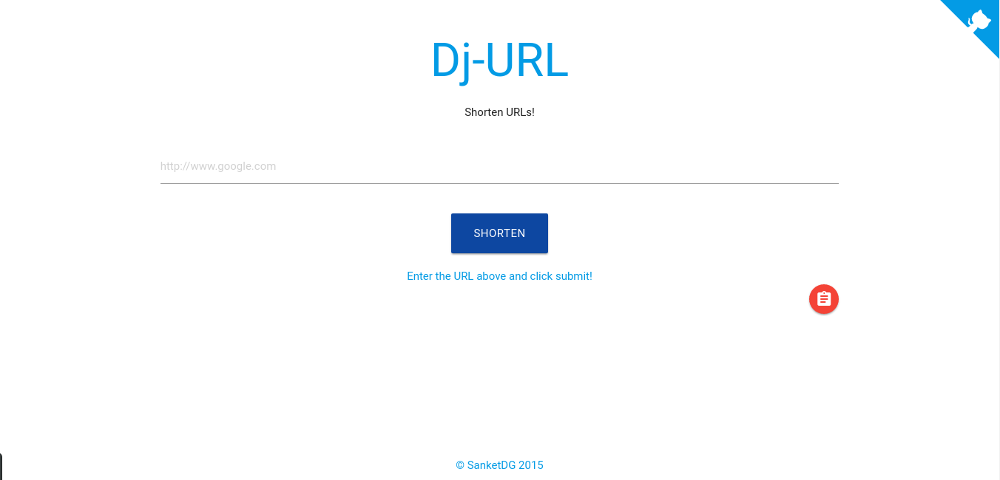

# Dj-URL

An url shortener built using Django.
Uses [Materialize](http://materializecss.com) for the UI.

### Demo

[Dj-URL](http://djurl.herokuapp.com)

### Install

1. Clone the repo.
2. Install dependencies from requirements.txt
3. cd to the directory and run `foreman start`
